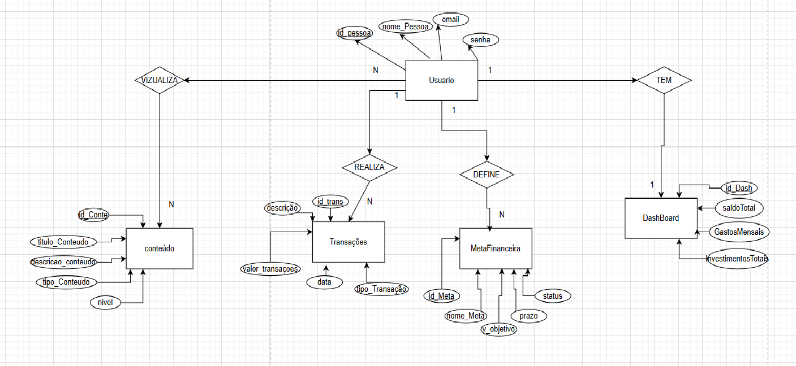
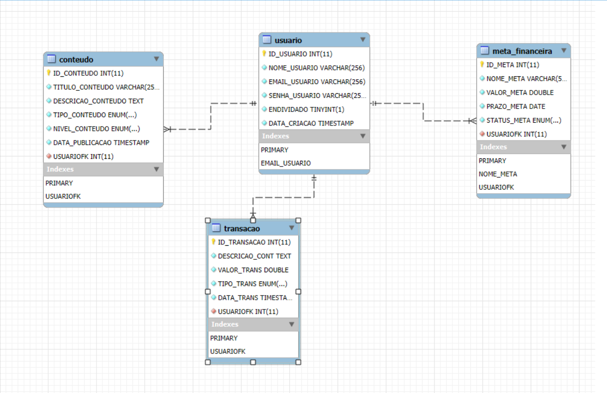

# Arquitetura da solução

Pré-requisitos: <a href="04-Projeto-interface.md"> Projeto de interface</a>

Definição de como o software é estruturado em termos dos componentes que fazem parte da solução e do ambiente de hospedagem da aplicação.

## Diagrama de classes

O diagrama de classes ilustra graficamente a estrutura do software e como cada uma das classes estará interligada. Essas classes servem de modelo para materializar os objetos que serão executados na memória.

> **Links úteis**:
> - [Diagramas de classes - documentação da IBM](https://www.ibm.com/docs/pt-br/rational-soft-arch/9.7.0?topic=diagrams-class)
> - [O que é um diagrama de classe UML?](https://www.lucidchart.com/pages/pt/o-que-e-diagrama-de-classe-uml)

##  Modelo de dados

### Modelo ER

O Modelo ER representa, por meio de um diagrama, como as entidades (coisas, objetos) se relacionam entre si na aplicação interativa.

> **Links úteis**:
> - [Como fazer um diagrama entidade relacionamento](https://www.lucidchart.com/pages/pt/como-fazer-um-diagrama-entidade-relacionamento)

### Esquema relacional

### Modelo físico
---
CREATE DATABASE BD_CASHWISE;
USE BD_CASHWISE;
CREATE TABLE USUARIO (
    ID_USUARIO INT NOT NULL AUTO_INCREMENT PRIMARY KEY,
    NOME_USUARIO VARCHAR(256) NOT NULL,
    EMAIL_USUARIO VARCHAR(256) NOT NULL UNIQUE,
    SENHA_USUARIO VARCHAR(255) NOT NULL,
    ENDIVIDADO BOOLEAN NOT NULL,
    DATA_CRIACAO TIMESTAMP DEFAULT CURRENT_TIMESTAMP
);

CREATE TABLE CONTEUDO (
    ID_CONTEUDO INT NOT NULL AUTO_INCREMENT PRIMARY KEY,
    TITULO_CONTEUDO VARCHAR(256) NOT NULL,
    DESCRICAO_CONTEUDO TEXT NOT NULL,
    TIPO_CONTEUDO ENUM('INVESTIMENTO','ECONOMIA','VALORIZACAO') NOT NULL,
    NIVEL_CONTEUDO ENUM('INICIANTE','INTERMEDIARIO','AVANCADO') NOT NULL,
    DATA_PUBLICACAO TIMESTAMP DEFAULT CURRENT_TIMESTAMP,
    USUARIOFK INT NOT NULL,
    FOREIGN KEY (USUARIOFK) REFERENCES USUARIO (ID_USUARIO)
    ON DELETE CASCADE 
    ON UPDATE CASCADE
    );

CREATE TABLE META_FINANCEIRA (
	ID_META INT NOT NULL AUTO_INCREMENT PRIMARY KEY,
    NOME_META VARCHAR (56) NOT NULL UNIQUE ,
    VALOR_META DOUBLE NOT NULL,
    PRAZO_META DATE NOT NULL,
    STATUS_META ENUM ('SIGA EM FRENTE', ' QUASE LA', 'CONCLUIDO') NOT NULL,
    USUARIOFK INT NOT NULL,
    FOREIGN KEY (USUARIOFK) REFERENCES USUARIO (ID_USUARIO)
    ON DELETE CASCADE 
    ON UPDATE CASCADE
    );

CREATE TABLE TRANSACAO (
	ID_TRANSACAO INT NOT NULL AUTO_INCREMENT PRIMARY KEY,
    DESCRICAO_CONT TEXT NOT NULL,
    VALOR_TRANS DOUBLE NOT NULL,
    TIPO_TRANS ENUM ('RECEITA' , 'DESPESA') NOT NULL,
    DATA_TRANS TIMESTAMP DEFAULT CURRENT_TIMESTAMP,
    USUARIOFK INT NOT NULL,
    FOREIGN KEY (USUARIOFK) REFERENCES USUARIO (ID_USUARIO)
    ON DELETE CASCADE
    ON UPDATE CASCADE
    );
    
CREATE TABLE DASHBOARD (
ID_DASH INT NOT NULL AUTO_INCREMENT PRIMARY KEY,
USUARIOFK INT NOT NULL,
SALDOTOTAL_DASH DOUBLE NOT NULL, 
GASTOSMENSAIS_DASH DOUBLE NOT NULL,
INVESTIMENTOTOTAIS_DASH DOUBLE NOT NULL, 
FOREIGN KEY (USUARIOFK) REFERENCES USUARIO (ID_USUARIO)
    ON DELETE CASCADE
    ON UPDATE CASCADE
    );
---
 [script Sql](../src/db/mdf_Sql).

## Tecnologias

Descreva qual(is) tecnologias você vai usar para resolver o seu problema, ou seja, implementar a sua solução. Liste todas as tecnologias envolvidas, linguagens a serem utilizadas, serviços web, frameworks, bibliotecas, IDEs de desenvolvimento, e ferramentas.

Apresente também uma figura explicando como as tecnologias estão relacionadas ou como uma interação do usuário com o sistema vai ser conduzida, por onde ela passa até retornar uma resposta ao usuário.

| **Dimensão**   | **Tecnologia**  |
| ---            | ---             |
| Front-end      | HTML + CSS + JS + React |
| Back-end       | Node.js         |
| SGBD           | MySQL           |
| Deploy         | Vercel          |

## Hospedagem

Explique como a hospedagem e o lançamento da plataforma foram realizados.

> **Links úteis**:
> - [Website com GitHub Pages](https://pages.github.com/)
> - [Programação colaborativa com Repl.it](https://repl.it/)
> - [Getting started with Heroku](https://devcenter.heroku.com/start)
> - [Publicando seu site no Heroku](http://pythonclub.com.br/publicando-seu-hello-world-no-heroku.html)

## Qualidade de software

Conceituar qualidade é uma tarefa complexa, mas ela pode ser vista como um método gerencial que, por meio de procedimentos disseminados por toda a organização, busca garantir um produto final que satisfaça às expectativas dos stakeholders.

No contexto do desenvolvimento de software, qualidade pode ser entendida como um conjunto de características a serem atendidas, de modo que o produto de software atenda às necessidades de seus usuários. Entretanto, esse nível de satisfação nem sempre é alcançado de forma espontânea, devendo ser continuamente construído. Assim, a qualidade do produto depende fortemente do seu respectivo processo de desenvolvimento.

A norma internacional ISO/IEC 25010, que é uma atualização da ISO/IEC 9126, define oito características e 30 subcaracterísticas de qualidade para produtos de software. Com base nessas características e nas respectivas subcaracterísticas, identifique as subcaracterísticas que sua equipe utilizará como base para nortear o desenvolvimento do projeto de software, considerando alguns aspectos simples de qualidade. Justifique as subcaracterísticas escolhidas pelo time e elenque as métricas que permitirão à equipe avaliar os objetos de interesse.

> **Links úteis**:
> - [ISO/IEC 25010:2011 - Systems and Software Engineering — Systems and Software Quality Requirements and Evaluation (SQuaRE) — System and Software Quality Models](https://www.iso.org/standard/35733.html/)
> - [Análise sobre a ISO 9126 – NBR 13596](https://www.tiespecialistas.com.br/analise-sobre-iso-9126-nbr-13596/)
> - [Qualidade de software - Engenharia de Software](https://www.devmedia.com.br/qualidade-de-software-engenharia-de-software-29/18209)
